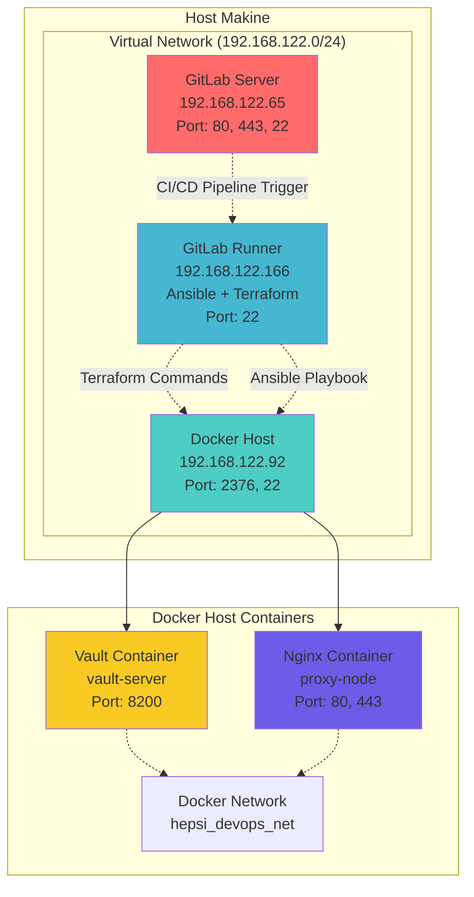
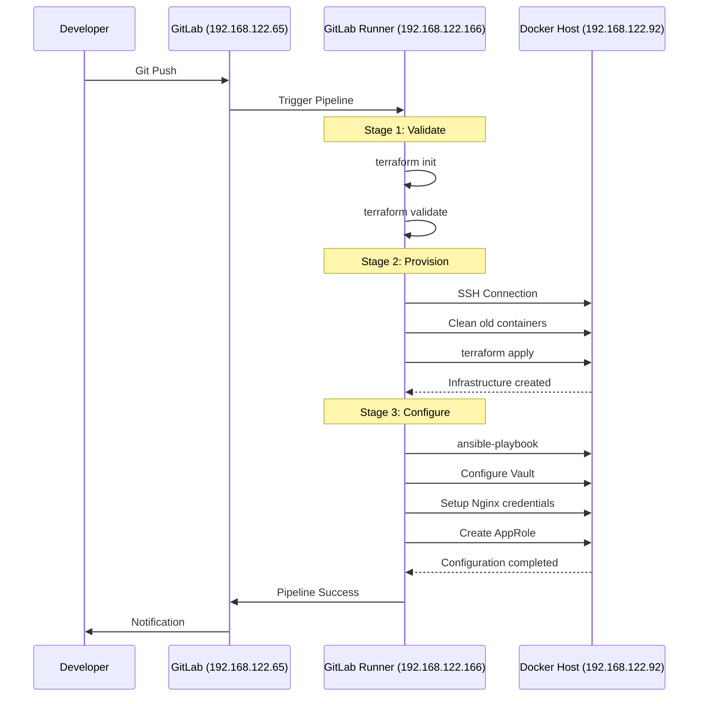
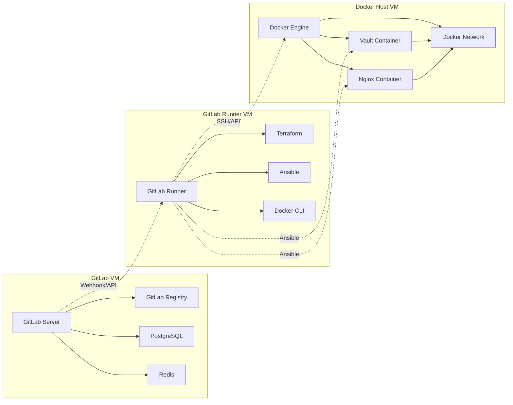

# Hepsiburada DevOps Case Study - Detaylı Proje Analizi

## Proje Genel Bakış

Bu proje,  DevOps case study'sidir. GitLab CI/CD, Terraform ve Ansible araçlarını kullanarak modern bir DevOps otomasyon pipeline'ı oluşturmaktadır. Proje, Docker konteynerları üzerinde HashiCorp Vault ve Nginx servislerini otomatik olarak deploy eder ve güvenli secret yönetimi implementasyonu sağlar.

## Network Topolojisi



## Detaylı Sistem Mimarisi

### 1. GitLab Server (192.168.122.65)

```
┌─────────────────────────────────────┐
│        GitLab Server VM             │
│    IP: 192.168.122.65               │
├─────────────────────────────────────┤
│ Servisler:                          │
│ • GitLab CE/EE                      │
│ • GitLab Registry                   │
│ • PostgreSQL Database               │
│ • Redis Cache                       │
├─────────────────────────────────────┤
│ Portlar:                            │
│ • 80/tcp  - HTTP                    │
│ • 443/tcp - HTTPS                   │
│ • 22/tcp  - SSH (Git)               │
├─────────────────────────────────────┤
│ Fonksiyonlar:                       │
│ • Source Code Repository            │
│ • CI/CD Pipeline Management         │
│ • Project Management                │
│ • User Authentication              │
└─────────────────────────────────────┘
```

### 2. Docker Host (192.168.122.92)

```
┌─────────────────────────────────────┐
│         Docker Host VM              │
│    IP: 192.168.122.92               │
├─────────────────────────────────────┤
│ Servisler:                          │
│ • Docker Engine                     │
│ • Docker API (2376)                 │
├─────────────────────────────────────┤
│ Portlar:                            │
│ • 2376/tcp - Docker API             │
│ • 22/tcp   - SSH                    │
│ • 8200/tcp - Vault (forwarded)      │
│ • 80/tcp   - Nginx (forwarded)      │
│ • 443/tcp  - Nginx SSL (forwarded)  │
├─────────────────────────────────────┤
│ Docker Containers:                  │
│ ┌─────────────────────────────────┐ │
│ │    Vault Container              │ │
│ │    Name: vault-server           │ │
│ │    Image: hashicorp/vault       │ │
│ │    Mode: -dev                   │ │
│ │    Token: root                  │ │
│ │    Port: 8200                   │ │
│ └─────────────────────────────────┘ │
│ ┌─────────────────────────────────┐ │
│ │    Nginx Container              │ │
│ │    Name: proxy-node             │ │
│ │    Image: nginx:latest          │ │
│ │    Ports: 80, 443               │ │
│ └─────────────────────────────────┘ │
│ ┌─────────────────────────────────┐ │
│ │    Docker Network               │ │
│ │    Name: hepsi_devops_net       │ │
│ │    Driver: bridge               │ │
│ └─────────────────────────────────┘ │
└─────────────────────────────────────┘
```

### 3. Ansible-Terraform GitLab Runner (192.168.122.166)

```
┌─────────────────────────────────────┐
│    GitLab Runner VM                 │
│    IP: 192.168.122.166              │
├─────────────────────────────────────┤
│ Servisler:                          │
│ • GitLab Runner Service             │
│ • Terraform Binary                  │
│ • Ansible                           │
│ • Docker Client                     │
├─────────────────────────────────────┤
│ Portlar:                            │
│ • 22/tcp - SSH                      │
├─────────────────────────────────────┤
│ Araçlar:                            │
│ • Terraform v1.x                    │
│ • Ansible v2.x                      │
│ • Docker CLI                        │
│ • Python3                           │
│ • Git                               │
├─────────────────────────────────────┤
│ Runner Tags:                        │
│ • ansible-terraform                 │
├─────────────────────────────────────┤
│ SSH Keys:                           │
│ • /root/.ssh/id_rsa (Docker Host)   │
│ • Known Hosts configured            │
└─────────────────────────────────────┘
```

## Pipeline İş Akışı



## Network Flow Diyagramı

```
Host Makine
├── Virtual Network Bridge (virbr0)
│   └── Subnet: 192.168.122.0/24
│       ├── DHCP Range: 192.168.122.2-254
│       └── Gateway: 192.168.122.1
│
├── VM1: GitLab (192.168.122.65)
│   ├── Inbound: 80, 443, 22
│   └── Outbound: Internet access
│
├── VM2: Docker Host (192.168.122.92)
│   ├── Inbound: 2376 (Docker API), 22 (SSH)
│   ├── Forwarded: 8200 (Vault), 80/443 (Nginx)
│   └── Docker Network: hepsi_devops_net
│       ├── Vault Container: 172.17.0.x:8200
│       └── Nginx Container: 172.17.0.x:80,443
│
└── VM3: GitLab Runner (192.168.122.166)
    ├── Inbound: 22 (SSH)
    ├── Outbound: GitLab API calls
    └── SSH to Docker Host: 22
```

## Servis Bağımlılıkları



## Güvenlik Yapısı

```
Firewall Rules:
├── GitLab VM (192.168.122.65)
│   ├── Allow: 80/tcp, 443/tcp (Web Interface)
│   ├── Allow: 22/tcp (Git SSH)
│   └── Deny: All other inbound
│
├── Docker Host VM (192.168.122.92)
│   ├── Allow: 22/tcp from Runner VM
│   ├── Allow: 2376/tcp from Runner VM (Docker API)
│   ├── Allow: 8200/tcp from Runner VM (Vault)
│   ├── Allow: 80,443/tcp (Nginx)
│   └── Deny: All other inbound
│
└── GitLab Runner VM (192.168.122.166)
    ├── Allow: 22/tcp (SSH Management)
    ├── Outbound: GitLab API (443/tcp)
    ├── Outbound: Docker Host SSH (22/tcp)
    └── Outbound: Docker API (2376/tcp)
```

## Proje Yapısı

```
devops-case/
├── .gitlab-ci.yml          # GitLab CI/CD pipeline tanımları
├── terraform/              # Terraform altyapı kodları
│   ├── main.tf             # Ana Terraform konfigürasyonu
│   ├── variables.tf        # Terraform değişkenleri
│   └── outputs.tf          # Terraform çıktıları
├── ansible/                # Ansible konfigürasyon dosyaları
│   ├── inventory.ini       # Ansible inventory dosyası
│   ├── playbook.yml        # Ana Ansible playbook
│   ├── artifacts/          # Pipeline artifact'ları
│   └── roles/              # Ansible rolleri
└── README.md               # Proje dokümantasyonu
```

## GitLab CI/CD Pipeline

### Pipeline Konfigürasyonu

Pipeline, `.gitlab-ci.yml` dosyasında tanımlanan üç ana aşamadan oluşur:

```yaml
stages:
  - validate
  - provision
  - configure

tags:
  - ansible-terraform  # Tüm job'lar bu runner'da çalışır
```

### Aşama 1: Validate

**Amaç:** Terraform kodlarının syntax kontrolü ve validasyonu

**Süreç:**
1. `terraform` dizinine geçiş yapılır
2. `terraform init` komutu ile provider'lar initialize edilir
3. `terraform validate` ile HCL kodları doğrulanır
4. Herhangi bir syntax hatası durumunda pipeline durdurulur

**Komutlar:**
```bash
cd terraform
terraform init
terraform validate
```

### Aşama 2: Provision

**Amaç:** Doğrulanmış Terraform kodları ile altyapının oluşturulması

**Ön Temizlik İşlemleri:**
```bash
# Mevcut container'ları durdur ve kaldır
docker stop vault-server proxy-node 2>/dev/null || true
docker rm vault-server proxy-node 2>/dev/null || true

# Mevcut network'ü kaldır  
docker network rm hepsi_devops_net 2>/dev/null || true
```

**Altyapı Oluşturma:**
```bash
cd terraform
terraform init
terraform apply -auto-approve
```

**Artifact Oluşturma:**
- `ansible/inventory.ini` dosyası artifact olarak kaydedilir
- Bir sonraki aşamada kullanılmak üzere pipeline'da tutulur

### Aşama 3: Configure

**Amaç:** Oluşturulan altyapının Ansible ile konfigüre edilmesi

**Dependency:** `provision` aşamasına bağımlıdır

**Ortam Hazırlığı:**
```bash
export ANSIBLE_HOST_KEY_CHECKING=False
```

**Konfigürasyon Çalıştırma:**
```bash
ansible-playbook -i ansible/inventory.ini ansible/playbook.yml
```

## Terraform Altyapı Yönetimi

### Docker Provider Konfigürasyonu

```hcl
terraform {
  required_providers {
    docker = {
      source  = "kreuzwerker/docker"
      version = "~> 3.0.1"
    }
  }
}

provider "docker" {
  host = "tcp://192.168.122.92:2376"
}
```

### Network Oluşturma

```hcl
resource "docker_network" "hepsi_devops_net" {
  name = "hepsi_devops_net"
  driver = "bridge"
}
```

### Vault Container

```hcl
resource "docker_container" "vault" {
  image = "hashicorp/vault:latest"
  name  = "vault-server"
  
  command = ["vault", "server", "-dev", "-dev-root-token-id=root"]
  
  ports {
    internal = 8200
    external = 8200
  }
  
  networks_advanced {
    name = docker_network.hepsi_devops_net.name
  }
  
  env = [
    "VAULT_DEV_ROOT_TOKEN_ID=root",
    "VAULT_DEV_LISTEN_ADDRESS=0.0.0.0:8200"
  ]
}
```

### Nginx Container

```hcl
resource "docker_container" "nginx" {
  image = "nginx:latest"
  name  = "proxy-node"
  
  ports {
    internal = 80
    external = 80
  }
  
  ports {
    internal = 443
    external = 443
  }
  
  networks_advanced {
    name = docker_network.hepsi_devops_net.name
  }
}
```

## Ansible Konfigürasyon Yönetimi

### Inventory Yapısı

```ini
[vault_servers]
192.168.122.92 ansible_port=22 ansible_user=root ansible_ssh_private_key_file=/root/.ssh/id_rsa

[nginx_servers]  
192.168.122.92 ansible_port=22 ansible_user=root ansible_ssh_private_key_file=/root/.ssh/id_rsa
```

### Playbook Yapısı

Ana playbook (`playbook.yml`) şu görevleri içerir:

#### 1. Vault Hazırlık Kontrolü

```yaml
- name: Vault sunucusunun hazır olmasını bekle
  uri:
    url: "http://{{ ansible_host }}:8200/v1/sys/health"
    method: GET
  register: vault_health
  until: vault_health.status == 200
  retries: 30
  delay: 10
```

#### 2. Vault Authentication

```yaml
- name: Vault'a root token ile giriş yap
  uri:
    url: "http://{{ ansible_host }}:8200/v1/auth/token/lookup-self"
    method: GET
    headers:
      X-Vault-Token: "root"
  register: vault_auth
```

#### 3. Secret Oluşturma

```yaml
- name: Nginx kimlik bilgilerini Vault'a kaydet
  uri:
    url: "http://{{ ansible_host }}:8200/v1/secret/data/nginx_creds"
    method: POST
    headers:
      X-Vault-Token: "root"
    body_format: json
    body:
      data:
        username: "hepsiburada"
        password: "devops"
```

#### 4. Policy Oluşturma

```yaml
- name: Nginx için sadece okuma yetkisi olan policy oluştur
  uri:
    url: "http://{{ ansible_host }}:8200/v1/sys/policies/acl/nginx-creds-readonly"
    method: PUT
    headers:
      X-Vault-Token: "root"
    body_format: json
    body:
      policy: |
        path "secret/data/nginx_creds" {
          capabilities = ["read"]
        }
```

#### 5. AppRole Konfigürasyonu

```yaml
- name: AppRole authentication method'unu etkinleştir
  uri:
    url: "http://{{ ansible_host }}:8200/v1/sys/auth/approle"
    method: POST
    headers:
      X-Vault-Token: "root"
    body_format: json
    body:
      type: "approle"

- name: Nginx uygulaması için AppRole oluştur
  uri:
    url: "http://{{ ansible_host }}:8200/v1/auth/approle/role/nginx-app"
    method: POST
    headers:
      X-Vault-Token: "root"
    body_format: json
    body:
      policies: ["nginx-creds-readonly"]
      token_ttl: "1h"
      token_max_ttl: "4h"
```

#### 6. Role ID ve Secret ID Alma

```yaml
- name: AppRole Role ID'sini al
  uri:
    url: "http://{{ ansible_host }}:8200/v1/auth/approle/role/nginx-app/role-id"
    method: GET
    headers:
      X-Vault-Token: "root"
  register: role_id_response

- name: AppRole Secret ID oluştur
  uri:
    url: "http://{{ ansible_host }}:8200/v1/auth/approle/role/nginx-app/secret-id"
    method: POST
    headers:
      X-Vault-Token: "root"
  register: secret_id_response
```

#### 7. Authentication Testi

```yaml
- name: AppRole ile Vault'a giriş yapabildiğini test et
  uri:
    url: "http://{{ ansible_host }}:8200/v1/auth/approle/login"
    method: POST
    body_format: json
    body:
      role_id: "{{ role_id_response.json.data.role_id }}"
      secret_id: "{{ secret_id_response.json.data.secret_id }}"
  register: approle_login
```

#### 8. Artifact Dosyası Oluşturma

```yaml
- name: AppRole kimlik bilgilerini dosyaya kaydet
  copy:
    content: |
      approle_role_id: {{ role_id_response.json.data.role_id }}
      approle_secret_id: {{ secret_id_response.json.data.secret_id }}
      vault_token: {{ approle_login.json.auth.client_token }}
    dest: "ansible/artifacts/approle_credentials.yml"
  delegate_to: localhost
```

## Güvenlik Implementasyonu

### 1. Secret Yönetimi
- Hassas bilgiler (username/password) Vault'ta güvenli olarak saklanır
- Root token sadece initial setup için kullanılır
- Production'da AppRole tabanlı authentication kullanılır

### 2. Yetkilendirme Modeli
- `nginx-creds-readonly` policy'si ile minimum yetki prensibi uygulanır
- Nginx uygulaması sadece kendi credential'larını okuyabilir
- Token'lar TTL (Time To Live) ile sınırlandırılmıştır

### 3. Network Segmentasyonu
- Tüm servisler isolated Docker network'ünde çalışır
- Sadece gerekli portlar dışarıya expose edilir
- Container'lar arası iletişim kontrollü şekilde sağlanır

## Pipeline Benefits ve Özellikler

### 1. Infrastructure as Code (IaC)
- Tüm altyapı Terraform ile kod olarak yönetilir
- Version control ile değişiklik takibi yapılabilir
- Ortamlar arası tutarlılık sağlanır

### 2. Configuration as Code (CaC)
- Ansible playbook'ları ile konfigürasyon otomasyonu
- İdempotent operasyonlar (tekrar çalıştırılabilir)
- Declarative approach ile desired state management

### 3. Otomatik Rollback Capability
- Pipeline herhangi bir aşamada hata alırsa otomatik durur
- Manuel müdahale gerektiğinde kolayca debug edilebilir
- Temizlik işlemleri ile ortam sıfırlanabilir

### 4. Artifact Management
- Pipeline aşamaları arası veri aktarımı
- Credential'lar güvenli şekilde saklanır ve aktarılır
- Reproducible builds sağlanır

## Monitoring ve Debugging

### Vault Health Check
```bash
curl -s http://192.168.122.92:8200/v1/sys/health | jq
```

### Container Status Check
```bash
docker ps --filter name=vault-server
docker ps --filter name=proxy-node
```

### Network Inspection
```bash
docker network inspect hepsi_devops_net
```

### Vault Secret Verification
```bash
# AppRole ile login
VAULT_TOKEN=$(curl -s -X POST \
  -d '{"role_id":"<role_id>","secret_id":"<secret_id>"}' \
  http://192.168.122.92:8200/v1/auth/approle/login | jq -r .auth.client_token)

# Secret'ı oku
curl -s -H "X-Vault-Token: $VAULT_TOKEN" \
  http://192.168.122.92:8200/v1/secret/data/nginx_creds | jq
```

## Best Practices Implementasyonu

### 1. Least Privilege Access
- AppRole sadece gerekli secret'lara erişebilir
- Token'lar sınırlı sürelidir
- Policy'ler granular olarak tanımlanmıştır

### 2. Automation First
- Manuel step'ler minimize edilmiştir
- Idempotent operations kullanılmıştır
- Error handling ve retry mekanizmaları mevcuttur

### 3. Environment Isolation
- Docker network ile izolasyon sağlanmıştır
- Container'lar arası communication kontrollüdür
- Development mode kullanımı test ortamı için uygundur

### 4. Documentation as Code
- Tüm konfigürasyonlar self-documenting'dir
- Ansible task'ları açıklayıcı isimlerle yazılmıştır
- Pipeline step'leri net olarak tanımlanmıştır

## Sonuç

Bu proje, modern DevOps pratiklerini uygulayan kapsamlı bir case study'dir. GitLab CI/CD, Terraform ve Ansible araçlarının entegrasyonu ile güvenli, ölçeklenebilir ve sürdürülebilir bir altyapı otomasyon sistemi oluşturulmuştur. HashiCorp Vault entegrasyonu ile secret management best practice'leri implementasyonu, projenin enterprise düzeyde kullanıma hazır olduğunu göstermektedir.