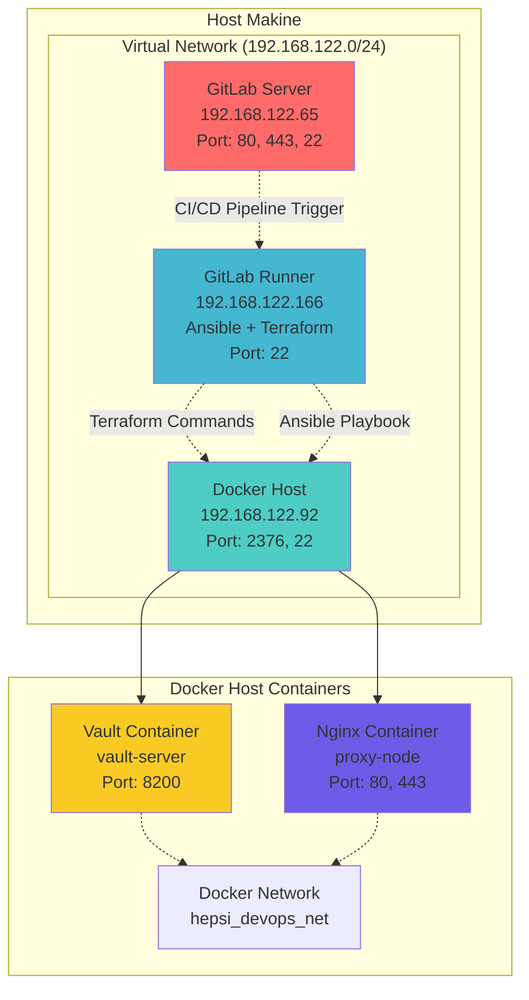
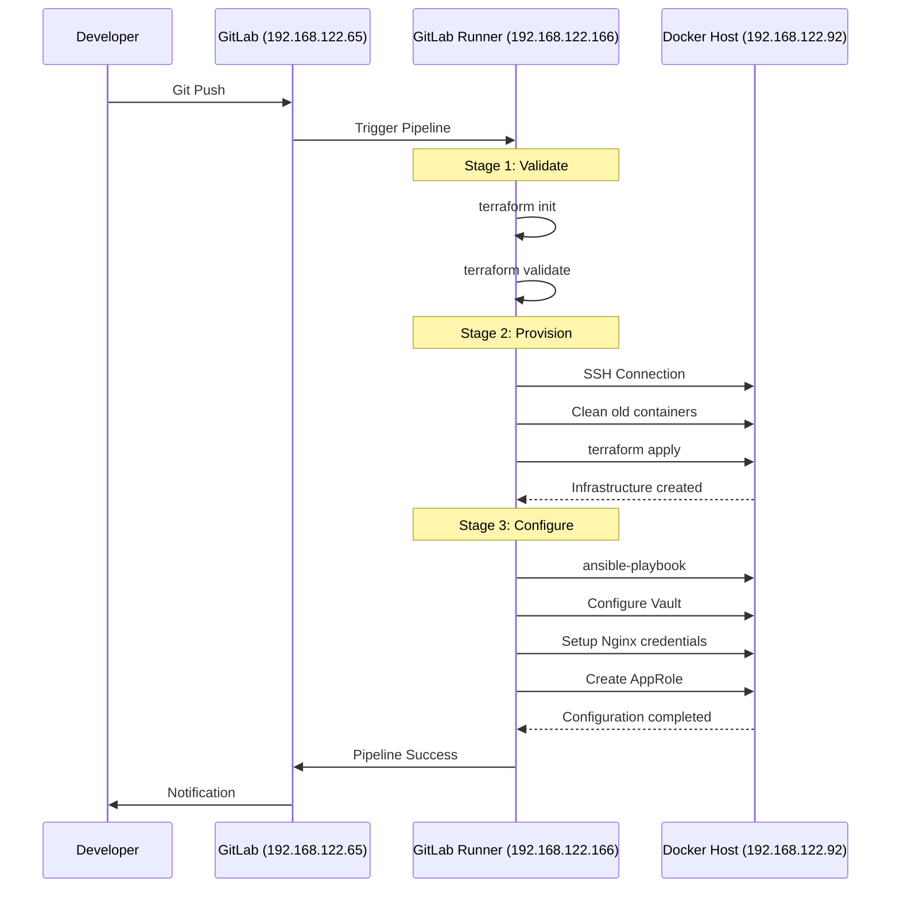
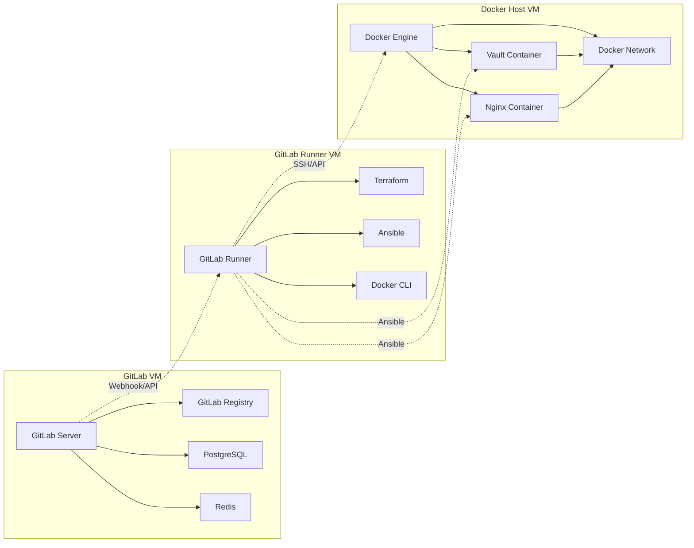

# DevOps Case Study - Detaylı Proje Analizi

[[Proje Video]](https://youtu.be/j5BgFAAyjL0)

## Proje Genel Bakış

Bu proje,  DevOps case study'sidir. GitLab CI/CD, Terraform ve Ansible araçlarını kullanarak modern bir DevOps otomasyon pipeline'ı oluşturmaktadır. Proje, Docker konteynerları üzerinde HashiCorp Vault ve Nginx servislerini otomatik olarak deploy eder ve güvenli secret yönetimi implementasyonu sağlar.

## Network Topolojisi



## Detaylı Sistem Mimarisi

### 1. GitLab Server (192.168.122.65)

```
┌─────────────────────────────────────┐
│        GitLab Server VM             │
│    IP: 192.168.122.65               │
├─────────────────────────────────────┤
│ Servisler:                          │
│ • GitLab CE/EE                      │
│ • GitLab Registry                   │
│ • PostgreSQL Database               │
│ • Redis Cache                       │
├─────────────────────────────────────┤
│ Portlar:                            │
│ • 80/tcp  - HTTP                    │
│ • 443/tcp - HTTPS                   │
│ • 22/tcp  - SSH (Git)               │
├─────────────────────────────────────┤
│ Fonksiyonlar:                       │
│ • Source Code Repository            │
│ • CI/CD Pipeline Management         │
│ • Project Management                │
│ • User Authentication              │
└─────────────────────────────────────┘
```

### 2. Docker Host (192.168.122.92)

```
┌─────────────────────────────────────┐
│         Docker Host VM              │
│    IP: 192.168.122.92               │
├─────────────────────────────────────┤
│ Servisler:                          │
│ • Docker Engine                     │
│ • Docker API (2376)                 │
├─────────────────────────────────────┤
│ Portlar:                            │
│ • 2376/tcp - Docker API             │
│ • 22/tcp   - SSH                    │
│ • 8200/tcp - Vault (forwarded)      │
│ • 80/tcp   - Nginx (forwarded)      │
│ • 443/tcp  - Nginx SSL (forwarded)  │
├─────────────────────────────────────┤
│ Docker Containers:                  │
│ ┌─────────────────────────────────┐ │
│ │    Vault Container              │ │
│ │    Name: vault-server           │ │
│ │    Image: hashicorp/vault       │ │
│ │    Mode: -dev                   │ │
│ │    Token: root                  │ │
│ │    Port: 8200                   │ │
│ └─────────────────────────────────┘ │
│ ┌─────────────────────────────────┐ │
│ │    Nginx Container              │ │
│ │    Name: proxy-node             │ │
│ │    Image: nginx:latest          │ │
│ │    Ports: 80, 443               │ │
│ └─────────────────────────────────┘ │
│ ┌─────────────────────────────────┐ │
│ │    Docker Network               │ │
│ │    Name: hepsi_devops_net       │ │
│ │    Driver: bridge               │ │
│ └─────────────────────────────────┘ │
└─────────────────────────────────────┘
```

### 3. Ansible-Terraform GitLab Runner (192.168.122.166)

```
┌─────────────────────────────────────┐
│    GitLab Runner VM                 │
│    IP: 192.168.122.166              │
├─────────────────────────────────────┤
│ Servisler:                          │
│ • GitLab Runner Service             │
│ • Terraform Binary                  │
│ • Ansible                           │
│ • Docker Client                     │
├─────────────────────────────────────┤
│ Portlar:                            │
│ • 22/tcp - SSH                      │
├─────────────────────────────────────┤
│ Araçlar:                            │
│ • Terraform v1.x                    │
│ • Ansible v2.x                      │
│ • Docker CLI                        │
│ • Python3                           │
│ • Git                               │
├─────────────────────────────────────┤
│ Runner Tags:                        │
│ • ansible-terraform                 │
├─────────────────────────────────────┤
│ SSH Keys:                           │
│ • /root/.ssh/id_rsa (Docker Host)   │
│ • Known Hosts configured            │
└─────────────────────────────────────┘
```

## Pipeline İş Akışı



## Network Flow Diyagramı

```
Host Makine
├── Virtual Network Bridge (virbr0)
│   └── Subnet: 192.168.122.0/24
│       ├── DHCP Range: 192.168.122.2-254
│       └── Gateway: 192.168.122.1
│
├── VM1: GitLab (192.168.122.65)
│   ├── Inbound: 80, 443, 22
│   └── Outbound: Internet access
│
├── VM2: Docker Host (192.168.122.92)
│   ├── Inbound: 2376 (Docker API), 22 (SSH)
│   ├── Forwarded: 8200 (Vault), 80/443 (Nginx)
│   └── Docker Network: hepsi_devops_net
│       ├── Vault Container: 172.17.0.x:8200
│       └── Nginx Container: 172.17.0.x:80,443
│
└── VM3: GitLab Runner (192.168.122.166)
    ├── Inbound: 22 (SSH)
    ├── Outbound: GitLab API calls
    └── SSH to Docker Host: 22
```

## Servis Bağımlılıkları



## Güvenlik Yapısı

```
Firewall Rules:
├── GitLab VM (192.168.122.65)
│   ├── Allow: 80/tcp, 443/tcp (Web Interface)
│   ├── Allow: 22/tcp (Git SSH)
│   └── Deny: All other inbound
│
├── Docker Host VM (192.168.122.92)
│   ├── Allow: 22/tcp from Runner VM
│   ├── Allow: 2376/tcp from Runner VM (Docker API)
│   ├── Allow: 8200/tcp from Runner VM (Vault)
│   ├── Allow: 80,443/tcp (Nginx)
│   └── Deny: All other inbound
│
└── GitLab Runner VM (192.168.122.166)
    ├── Allow: 22/tcp (SSH Management)
    ├── Outbound: GitLab API (443/tcp)
    ├── Outbound: Docker Host SSH (22/tcp)
    └── Outbound: Docker API (2376/tcp)
```

## Proje Yapısı

```
devops-case/
├── .gitlab-ci.yml          # GitLab CI/CD pipeline tanımları
├── terraform/              # Terraform altyapı kodları
│   ├── main.tf             # Ana Terraform konfigürasyonu
│   ├── variables.tf        # Terraform değişkenleri
│   └── outputs.tf          # Terraform çıktıları
├── ansible/                # Ansible konfigürasyon dosyaları
│   ├── inventory.ini       # Ansible inventory dosyası
│   ├── playbook.yml        # Ana Ansible playbook
│   ├── artifacts/          # Pipeline artifact'ları
│   └── roles/              # Ansible rolleri
└── README.md               # Proje dokümantasyonu
```

## GitLab CI/CD Pipeline


### Pipeline Konfigürasyonu

Pipeline, `.gitlab-ci.yml` dosyasında tanımlanan üç ana aşamadan oluşur:

```yaml
stages:
  - validate
  - provision
  - configure

tags:
  - ansible-terraform  # Tüm job'lar bu runner'da çalışır
```

## Terraform Implementasyonu

### Provider Konfigürasyonu
```hcl
terraform {
  required_providers {
    docker = {
      source  = "kreuzwerker/docker"
      version = "~> 3.0.1"
    }
  }
}

provider "docker" {
  host = "tcp://192.168.122.92:2376"
}
```

### Kaynak Tanımları

#### Docker Network Oluşturma
```hcl
resource "docker_network" "hepsi_devops_net" {
  name   = "hepsi_devops_net"
  driver = "bridge"
}
```

#### Vault Container
```hcl
resource "docker_container" "vault" {
  image   = "hashicorp/vault:latest"
  name    = "vault-server"
  command = ["vault", "server", "-dev", "-dev-root-token-id=root"]
  
  ports {
    internal = 8200
    external = 8200
  }
  
  networks_advanced {
    name = docker_network.hepsi_devops_net.name
  }
  
  env = [
    "VAULT_DEV_ROOT_TOKEN_ID=root",
    "VAULT_DEV_LISTEN_ADDRESS=0.0.0.0:8200"
  ]
}
```

#### Nginx Container
```hcl
resource "docker_container" "nginx" {
  image = "nginx:latest"
  name  = "proxy-node"
  
  ports {
    internal = 80
    external = 80
  }
  
  ports {
    internal = 443
    external = 443
  }
  
  networks_advanced {
    name = docker_network.hepsi_devops_net.name
  }
}
```

## Ansible Konfigürasyonu

### Ana Playbook Görevleri

#### 1. Vault Sağlık Kontrolü
```yaml
- name: Vault sunucusunun hazır olmasını bekle
  uri:
    url: "http://{{ ansible_host }}:8200/v1/sys/health"
    method: GET
  register: vault_health
  until: vault_health.status == 200
  retries: 30
  delay: 10
```

#### 2. Vault Authentication
```yaml
- name: Vault'a root token ile giriş yap
  uri:
    url: "http://{{ ansible_host }}:8200/v1/auth/token/lookup-self"
    method: GET
    headers:
      X-Vault-Token: "root"
  register: vault_auth
```

#### 3. Secret Yönetimi
```yaml
- name: Nginx kimlik bilgilerini Vault'a kaydet
  uri:
    url: "http://{{ ansible_host }}:8200/v1/secret/data/nginx_creds"
    method: POST
    headers:
      X-Vault-Token: "root"
    body_format: json
    body:
      data:
        username: "hepsiburada"
        password: "devops"
```

#### 4. Güvenlik Policy Oluşturma
```yaml
- name: Nginx için sadece okuma yetkisi olan policy oluştur
  uri:
    url: "http://{{ ansible_host }}:8200/v1/sys/policies/acl/nginx-creds-readonly"
    method: PUT
    headers:
      X-Vault-Token: "root"
    body_format: json
    body:
      policy: |
        path "secret/data/nginx_creds" {
          capabilities = ["read"]
        }
```

#### 5. AppRole Authentication
```yaml
- name: AppRole authentication method'unu etkinleştir
  uri:
    url: "http://{{ ansible_host }}:8200/v1/sys/auth/approle"
    method: POST
    headers:
      X-Vault-Token: "root"
    body_format: json
    body:
      type: "approle"

- name: Nginx uygulaması için AppRole oluştur
  uri:
    url: "http://{{ ansible_host }}:8200/v1/auth/approle/role/nginx-app"
    method: POST
    headers:
      X-Vault-Token: "root"
    body_format: json
    body:
      policies: ["nginx-creds-readonly"]
      token_ttl: "1h"
      token_max_ttl: "4h"
```

## GitLab CI/CD Pipeline


### Pipeline Aşamaları

```yaml
stages:
  - validate
  - provision  
  - configure
```

#### 1. Validate Stage
**Amaç**: Terraform kodlarının syntax kontrolü ve validasyonu

```bash
cd terraform
terraform init
terraform validate
```

#### 2. Provision Stage  
**Amaç**: Doğrulanmış Terraform kodları ile altyapının oluşturulması

**Ön Temizlik**:
```bash
# Mevcut container'ları durdur ve kaldır
docker stop vault-server proxy-node 2>/dev/null || true
docker rm vault-server proxy-node 2>/dev/null || true
# Mevcut network'ü kaldır  
docker network rm hepsi_devops_net 2>/dev/null || true
```

**Altyapı Oluşturma**:
```bash
cd terraform
terraform init
terraform apply -auto-approve
```

#### 3. Configure Stage
**Amaç**: Oluşturulan altyapının Ansible ile konfigüre edilmesi

```bash
export ANSIBLE_HOST_KEY_CHECKING=False
ansible-playbook -i ansible/inventory.ini ansible/playbook.yml
```

## Güvenlik Implementasyonu

### Secret Management
- Hassas bilgiler Vault'ta güvenli olarak saklanır
- Root token sadece initial setup için kullanılır
- Production'da AppRole tabanlı authentication kullanılır

### Access Control
- `nginx-creds-readonly` policy'si ile minimum yetki prensibi
- Nginx uygulaması sadece kendi credential'larını okuyabilir
- Token'lar TTL (Time To Live) ile sınırlandırılmış

### Network Security
- Tüm servisler isolated Docker network'ünde çalışır
- Sadece gerekli portlar dışarıya expose edilir
- Container'lar arası iletişim kontrollü şekilde sağlanır

## Test ve Doğrulama

### Sistem Durumu Kontrolleri
```bash
# Vault sağlık kontrolü
curl -s http://192.168.122.92:8200/v1/sys/health | jq

# Container durumu
docker ps --filter name=vault-server
docker ps --filter name=proxy-node

# Network kontrolü  
docker network inspect hepsi_devops_net
```

### AppRole Authentication Testi
```bash
# AppRole ile login
VAULT_TOKEN=$(curl -s -X POST \
  -d '{"role_id":"<role_id>","secret_id":"<secret_id>"}' \
  http://192.168.122.92:8200/v1/auth/approle/login | jq -r .auth.client_token)

# Secret'ı oku
curl -s -H "X-Vault-Token: $VAULT_TOKEN" \
  http://192.168.122.92:8200/v1/secret/data/nginx_creds | jq
```

## Projenin Güçlü Yanları

### Infrastructure as Code
- Tüm altyapı Terraform ile kod olarak yönetilir
- Version control ile değişiklik takibi yapılabilir
- Ortamlar arası tutarlılık sağlanır

### Configuration Management
- Ansible playbook'ları ile konfigürasyon otomasyonu
- İdempotent operasyonlar (tekrar çalıştırılabilir)
- Declarative approach ile desired state management

### Error Handling
- Pipeline herhangi bir aşamada hata alırsa otomatik durur
- Manuel müdahale gerektiğinde kolayca debug edilebilir
- Temizlik işlemleri ile ortam sıfırlanabilir

### Data Flow
- Pipeline aşamaları arası veri aktarımı
- Credential'lar güvenli şekilde saklanır ve aktarılır
- Reproducible builds sağlanır

## Geliştirme Alanları

### Projenin Zayıf Yanları
- **SSL/TLS Otomasyonu**: Efor harcanmadı (mantığa uymadı)
- **Static File Management**: Ansible templates üzerinden alınması yerine playbook'da oluşturuldu
- **Credential Management**: Süreç içerisinde verildi (güvenlik riski)
- **Time Management**: Zaman efektif kullanılamadı
- **Pipeline Testing**: Çok fazla pipeline test edildi
- **Process Complexity**: Süreç daha basit hale getirilebilir
- **Service Continuity**: Nginx kapatılıp yeni ayar ile tekrar ayağa kaldırılıyor (sürdürülebilir değil)
- **Best Practices**: Vault'un playbook'ları kullanılmadı, core ansible ile devam edildi

## Sonuç

Bu proje, modern DevOps pratiklerini uygulayan kapsamlı bir case study'dir. GitLab CI/CD, Terraform ve Ansible araçlarının entegrasyonu ile güvenli, ölçeklenebilir ve sürdürülebilir bir altyapı otomasyon sistemi oluşturulmuştur. HashiCorp Vault entegrasyonu ile secret management best practice'leri implementasyonu, projenin enterprise düzeyde kullanıma hazır olduğunu göstermektedir.

Proje, Infrastructure as Code, Configuration Management ve CI/CD pipeline'ları konularında güçlü bir örnek teşkil ederken, bazı geliştirme alanları da bulunmaktadır. Özellikle SSL/TLS otomasyonu, credential management ve service continuity konularında iyileştirmeler yapılabilir.